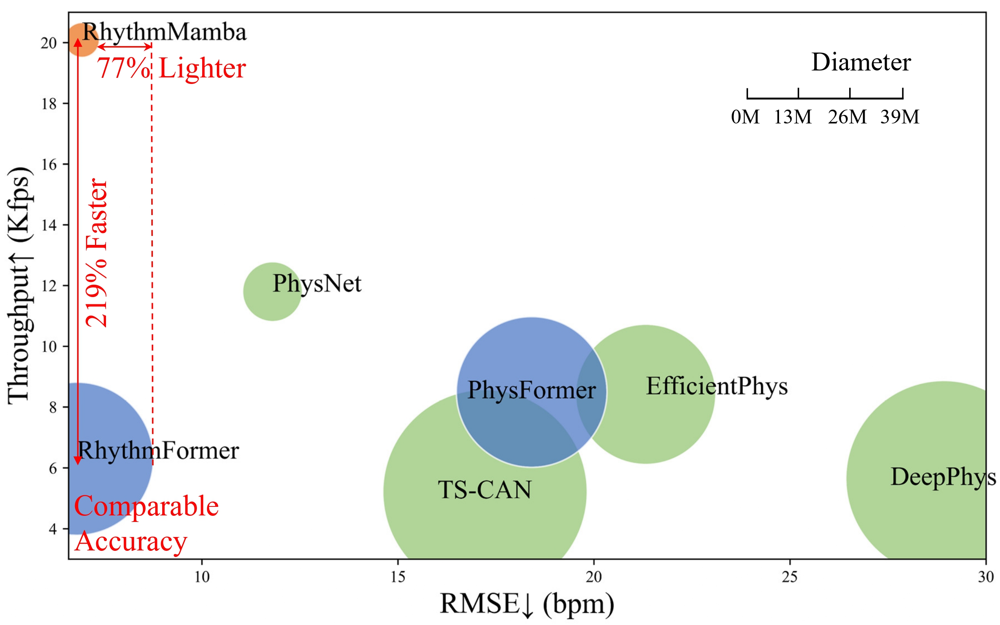

## Computational Cost Calculation

### ⚡Run：

STEP 1: Modify  ```cost_cal.py```  to select the model and input data format.

STEP 2: Run ```python cost_cal.py```


### 👀 Result：



NOTE 1: The test is conducted as a **30-second inference** (900 frames), and the results are reported as the average per frame.

NOTE 2: In the original implementation of the rPPG-toolbox, models such as **DeepPhys**, **TSCAN**, and **EfficientPhys** utilize **Code 1**. The reported performance, such as RMSE (Root Mean Square Error) shown in the figure, was calculated accordingly. However, this approach results in unreasonably high computational costs. Therefore, **Code 2** was adopted for cost calculation.

**Code 1：**

    elif img_size == 128: 
        self.final_dense_1 = nn.Linear(57600, self.nb_dense, bias=True)


**Code 2：**

    elif img_size == 128: 
        self.avg_pooling_3 = nn.AvgPool2d((4,4))
        self.final_dense_1 = nn.Linear(14400, self.nb_dense, bias=True)

